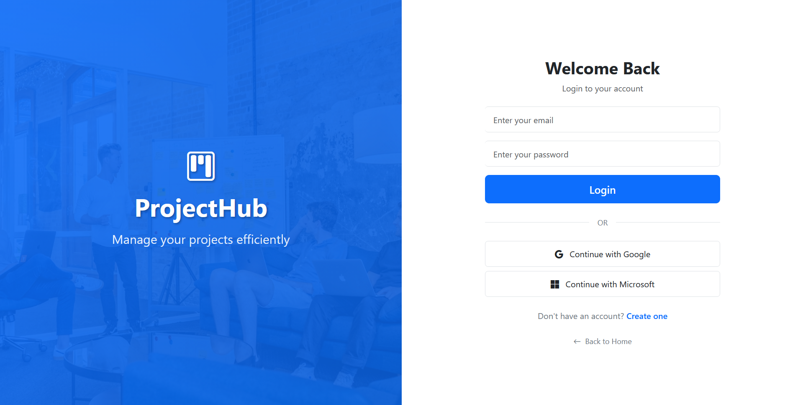
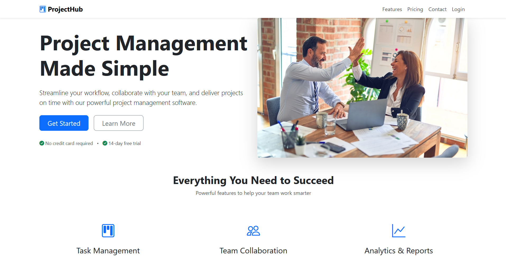
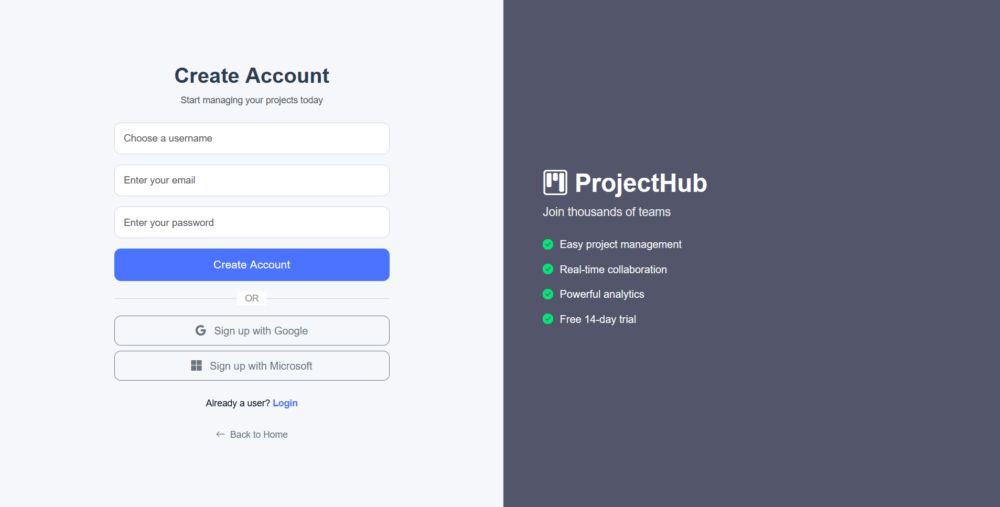
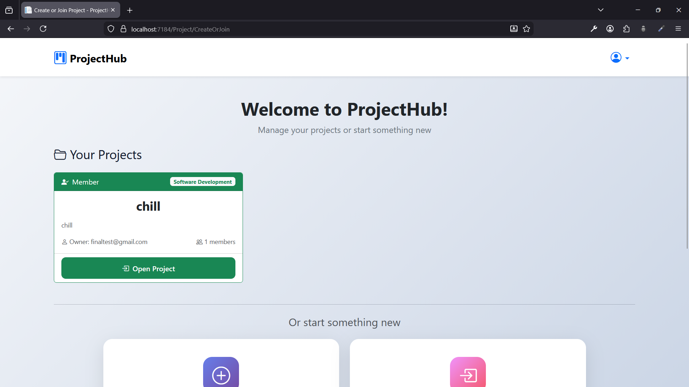
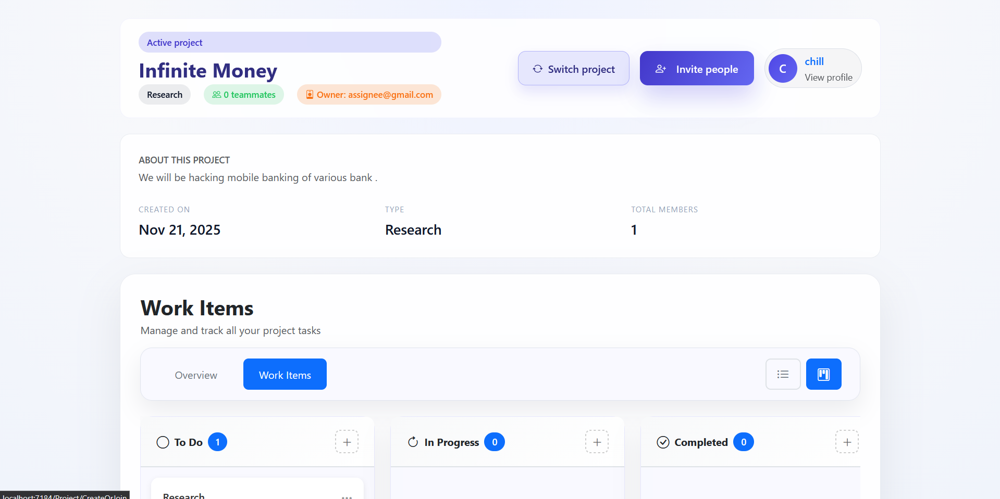
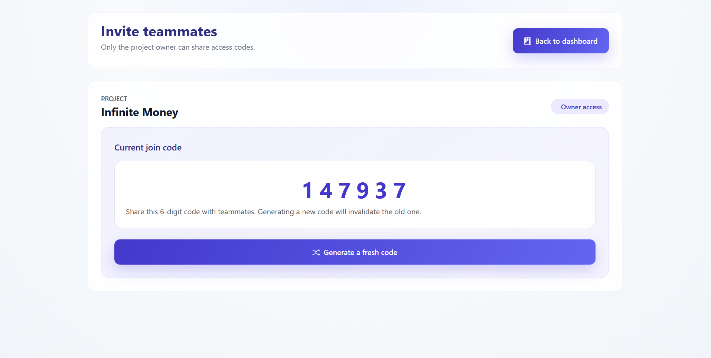
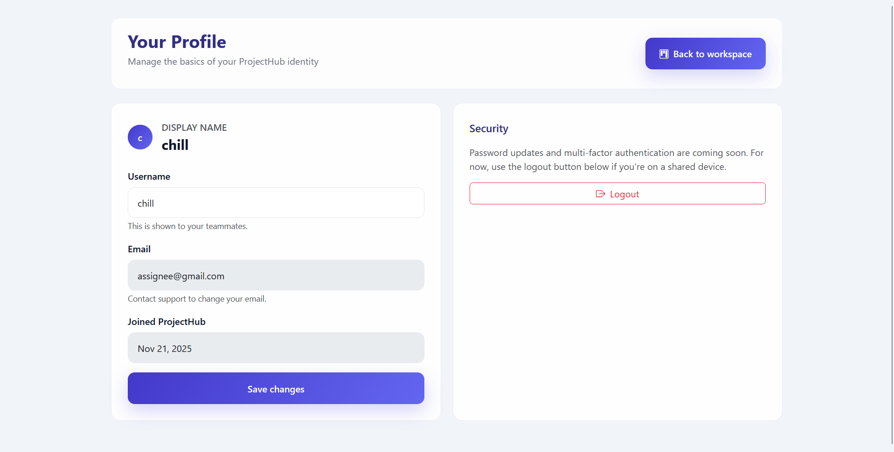

# 🚀 ProjectHub - Kanban Project Management System

<p align="center">
  
</p>

<p align="center">
  <strong>A modern, intuitive Kanban-style project management system built with ASP.NET Core MVC</strong>
</p>

<p align="center">
  <a href="#features">Features</a> •
  <a href="#tech-stack">Tech Stack</a> •
  <a href="#screenshots">Screenshots</a> •
  <a href="#installation">Installation</a> •
  <a href="#usage">Usage</a> •
  <a href="#contact">Contact</a>
</p>

---

## 📋 Overview

**ProjectHub** is a comprehensive Kanban-based project management solution designed to streamline team collaboration and task tracking. Built with enterprise-grade technologies, it offers a clean, responsive interface that makes managing projects effortless.

This project demonstrates my proficiency in full-stack .NET development, database design, and modern UI/UX principles.

---

## ✨ Features

### Core Functionality
- **Kanban Board** - Drag-and-drop task management with customizable columns
- **Project Management** - Create, join, and switch between multiple projects
- **User Authentication** - Secure login and registration system
- **User Profiles** - Personalized user settings and preferences
- **Real-time Updates** - Dynamic chart and progress tracking
- **Team Collaboration** - Invite members via project codes

### Additional Features
- 📊 **Analytics Dashboard** - Visual charts for project progress tracking
- 🔐 **Role-based Access Control** - Admin and member permissions
- 📱 **Responsive Design** - Works seamlessly on desktop and mobile
- 🎨 **Clean UI/UX** - Modern Bootstrap-based interface
- 📈 **Work Item Tracking** - Comprehensive task management

---

## 🛠️ Tech Stack

| Category | Technology |
|----------|------------|
| **Backend** | ASP.NET Core MVC (C#) |
| **Frontend** | Bootstrap 5, HTML5, CSS3, JavaScript |
| **Database** | Microsoft SQL Server |
| **ORM** | Entity Framework Core |
| **Authentication** | ASP.NET Core Identity |
| **Architecture** | MVC Pattern |

---

## 📸 Screenshots

### Landing Page
*Clean, professional landing page introducing the platform*


### User Authentication

#### Login
*Secure login interface with modern design*


#### Register
*User-friendly registration form*


### Project Management

#### Create or Join Project
*Easily create new projects or join existing ones with a code*


#### Switch Projects
*Seamlessly switch between multiple projects*


### Dashboard & Analytics

#### Home Dashboard
*Main dashboard with work items and project overview*


#### Analytics Chart
*Visual representation of project progress and statistics*


### Code to Join
*Share project codes for team collaboration*


### User Profile
*Manage personal information and preferences*


---

## ⚙️ Installation

### Prerequisites
- [.NET 6.0 SDK](https://dotnet.microsoft.com/download/dotnet/6.0) or later
- [SQL Server](https://www.microsoft.com/en-us/sql-server/sql-server-downloads) (Express or Developer edition)
- [Visual Studio 2022](https://visualstudio.microsoft.com/) (recommended) or VS Code

### Setup Instructions

1. **Clone the repository**
   ```bash
   git clone https://github.com/yourusername/projecthub.git
   cd projecthub
   ```

2. **Configure the database connection**
   
   Update `appsettings.json` with your SQL Server connection string:
   ```json
   {
     "ConnectionStrings": {
       "DefaultConnection": "Server=YOUR_SERVER;Database=ProjectHubDB;Trusted_Connection=True;MultipleActiveResultSets=true"
     }
   }
   ```

3. **Apply database migrations**
   ```bash
   dotnet ef database update
   ```

4. **Run the application**
   ```bash
   dotnet run
   ```

5. **Access the application**
   
   Open your browser and navigate to `https://localhost:5001`

---

## 🚀 Usage

1. **Register** - Create a new account on the registration page
2. **Create/Join Project** - Start a new project or join an existing one using a project code
3. **Manage Tasks** - Use the Kanban board to create, move, and track tasks
4. **Collaborate** - Invite team members and work together
5. **Track Progress** - Monitor project analytics and charts

---

## 📁 Project Structure

```
ProjectHub/
├── Controllers/          # MVC Controllers
├── Models/              # Entity models and ViewModels
├── Views/               # Razor views
│   ├── Home/
│   ├── Account/
│   ├── Project/
│   └── Shared/
├── Data/                # DbContext and migrations
├── Services/            # Business logic services
├── wwwroot/             # Static files (CSS, JS, images)
├── screenshots/         # Application screenshots
└── appsettings.json     # Configuration
```

---

## 🎯 Key Highlights

- **Clean Architecture** - Well-organized codebase following MVC best practices
- **Secure Authentication** - Implementation of ASP.NET Core Identity
- **Database Design** - Efficient relational database schema with SQL Server
- **Responsive UI** - Mobile-first design approach using Bootstrap
- **Modern C#** - Utilization of latest C# features and patterns

---


<p align="center">
  <strong>⭐ If you found this project interesting, please consider giving it a star! ⭐</strong>
</p>

<p align="center">
  Made with ❤️ and C#
</p># Project-Hub
